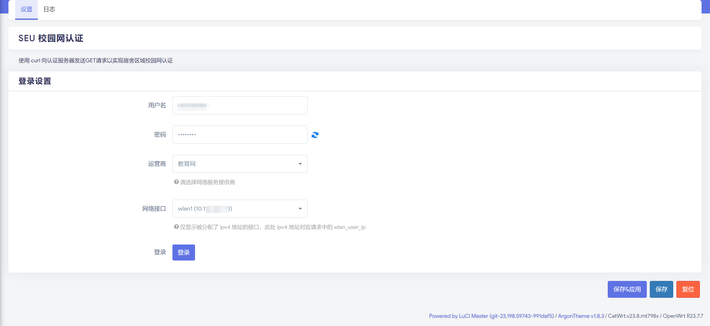

# luci-seu-net-login

## 功能特点

- 支持多种运营商：教育网、中国移动、中国电信和中国联通
- 自动检测并列出可用的网络接口
- 简单的用户界面，易于配置和使用
- 认证请求与响应查看功能

## 安装
### 直接安装
**Release中提供的ipk仅在Redmi AX6000 固件版本 CatWrt.v23.8.mt798x / OpenWrt R23.7.7 / LuCI Master (git-23.198.59743-991daf5) 上测试**
1. 下载 Release 中的 ipk 文件
2. 将 ipk 文件拷贝至路由器 /tmp 目录下
3. 使用 `opkg install [pkg]` 命令进行安装

### 编译安装

详细教程参考：

https://github.com/coolsnowwolf/lede/blob/master/README.md

https://www.cnblogs.com/rogunt/p/17236958.html

1. 将此软件包clone到您的OpenWrt SDK的`package`目录中。
2. 运行`make menuconfig`并选择`LuCI` -> `3. Applications` -> `luci-seu-net-login`.
3. 保存配置并运行`make package/luci-seu-net-login/compile V=s`来编译软件包。
4. 将生成的`.ipk`文件传输到您的OpenWrt路由器并安装。

## 使用方法

1. 在OpenWrt的Web界面中，导航到`服务` -> `SEU 校园网认证`.
2. 输入您的用户名和密码。
3. 选择您的运营商和网络接口。
4. 点击右下角保存&应用以保存配置。
5. 点击"登录"按钮进行认证。
6. 您可以在"日志"标签页查看登录请求及响应的日志。

## 依赖

- curl

## 许可证

本项目采用MIT LICENSE。

## 致谢

https://github.com/quzard/luci-app-seu-net

https://github.com/coolsnowwolf/lede

https://github.com/miaoermua/CatWrt